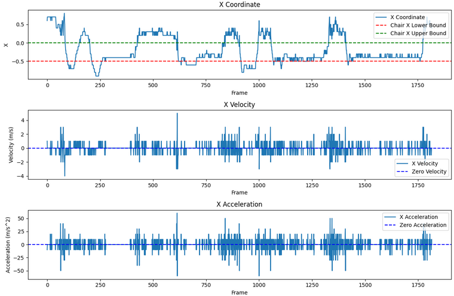
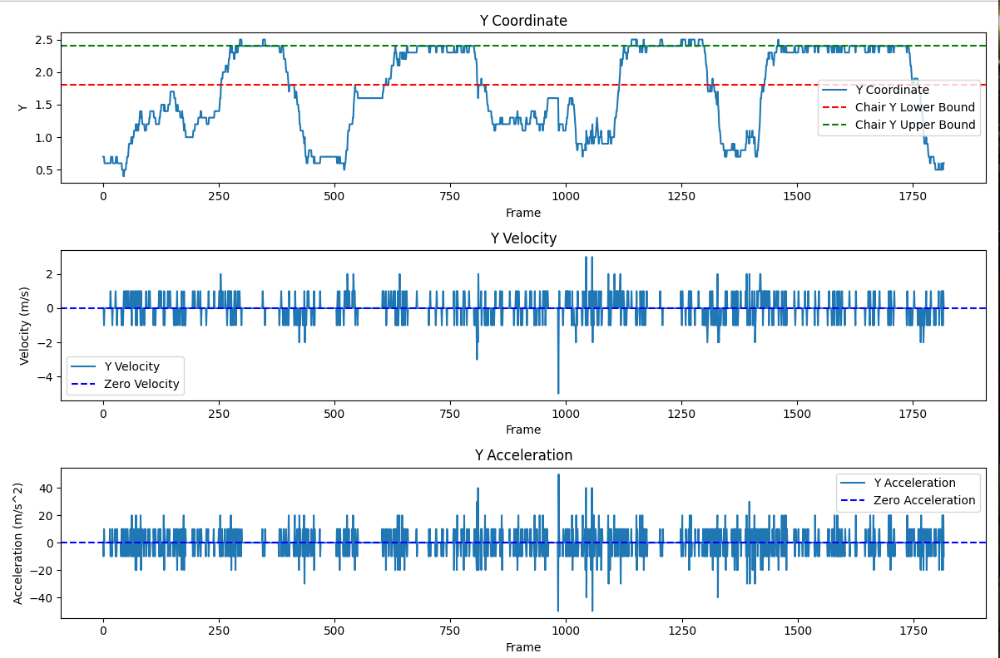
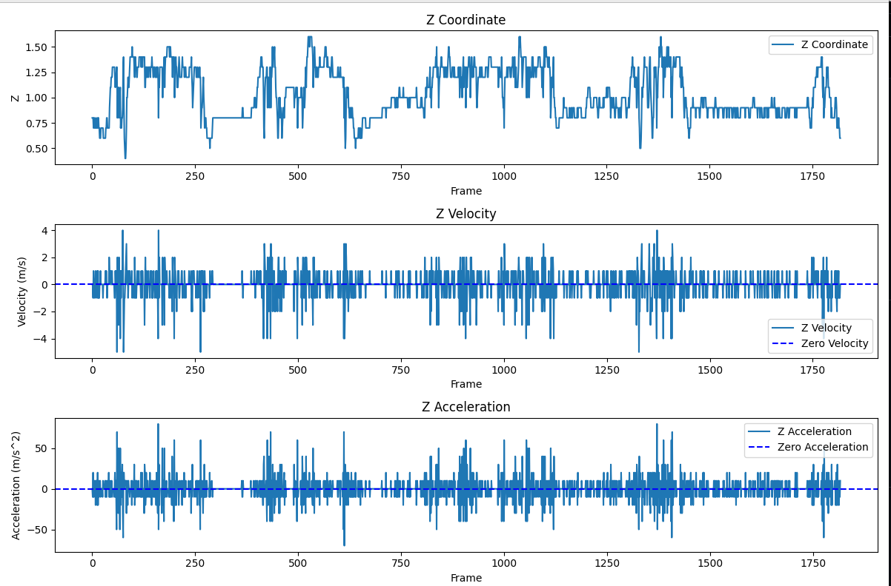

# Sitting Duration Calculator

## Overview

This repository hosts the Python application designed to calculate the duration of sitting time, leveraging location sensor data. It interprets movement within a room to discern the amount of time spent in a predefined sitting area.

## Getting Started

### Prerequisites

- Docker: Ensure Docker is installed on your system. [Install Docker](https://docs.docker.com/get-docker/).

### Setup and Installation

1. **Clone the Repository:**
   Clone the repository to your local machine using the following command:
    ```bash
    git clone https://github.com/noaamaman325158/VayyarHomeTaskNoaaMaman.git
    cd sitting-duration-calculator
    ```

2. **Environment Setup:**
   It's recommended to use a virtual environment for the Python setup.
    ```bash
    python -m venv .venv
    source .venv/bin/activate  # On Windows, use .venv\Scripts\activate
    ```

3. **Dependency Installation:**
   Install the required dependencies using pip.
    ```bash
    pip install -r requirements.txt
    ```

4. **Docker Build:**
   Build the Docker image from the Dockerfile present in the repository.
    ```bash
    docker build -t sitting_duration_calculator .
    ```

5. **Run the Container:**
   Start a Docker container from the image.
    ```bash
    docker run -p 4000:80 sitting_duration_calculator:latest
    ```

6. **Access the Application:**
   The service can be accessed through a web browser at:
   [http://localhost:4000](http://localhost:4000)

## API Endpoints

The API offers several endpoints for accessing the movement data:

- `GET /api/location`: Retrieves the current location data.
- `GET /api/duration`: Provides the calculated duration of sitting.

## How It Works

The application processes the sensor data to determine the total duration of sitting. It provides both a command-line interface and a web interface for easy interaction and visualization.

## Contributing

We welcome contributions to this project. Please refer to the [CONTRIBUTING.md](CONTRIBUTING.md) for contribution guidelines.

## License

This project is licensed under the MIT License. For more information, see the [LICENSE](LICENSE) file.

## Data Analysis and Visualization

For a detailed understanding of the sensor data, the application provides visual analyses for each coordinate:

### X Coordinate Analysis


### Y Coordinate Analysis


### Z Coordinate Analysis

