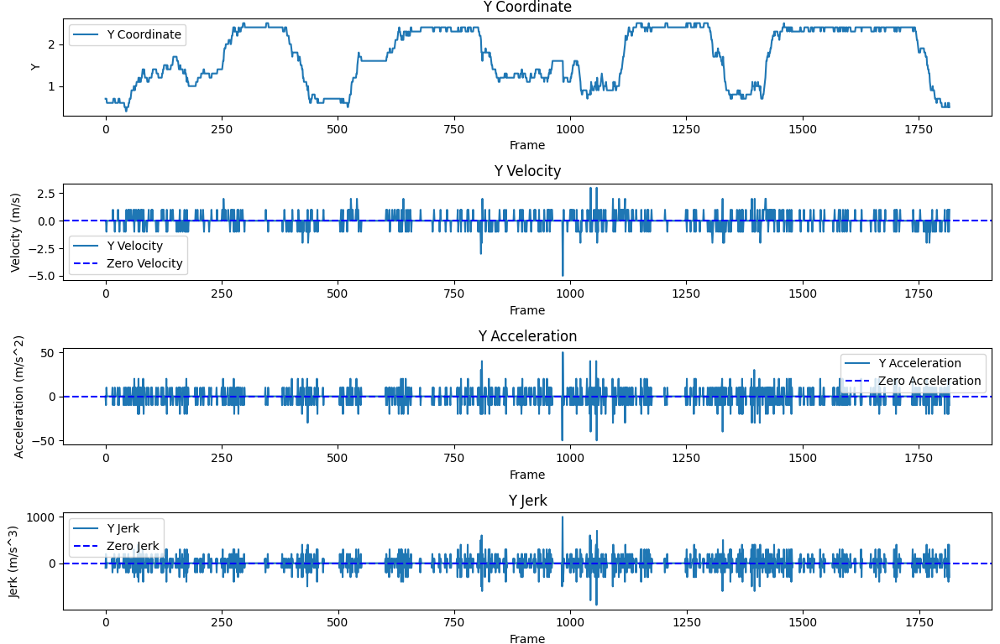

# Sitting Duration Calculator

## Overview

This repository hosts the Python system designed to calculate the duration of sitting time, leveraging location sensor data.
It interprets movement within a room to calculating the amount of time spent in a predefined sitting area.

#### Main Technologies/Programming Languages

-  **Python**
-  **Docker**
-  **Flask Framework**
-  **Matlab**
-  **Pandas**
-  **Numpy**
-  **RestAPI**
-  **Getting Started**
- 


### Prerequisites

- Docker: Ensure Docker is installed on your system. [Install Docker](https://docs.docker.com/get-docker/).

### Setup and Installation

1. **Clone the Repository:**
   Clone the repository to your local machine using the following command:
    ```bash
    git clone https://github.com/noaamaman325158/VayyarHomeTaskNoaaMaman.git
    cd sitting-duration-calculator
    ```

2. **Environment Setup:**
   It's recommended to use a virtual environment for the Python setup.
    ```bash
    python -m venv .venv
    source .venv/bin/activate  
    ```
    On Windows, use .venv\Scripts\activate
3. **Dependency Installation:**
   Install the required dependencies using pip.
    ```bash
    pip install -r requirements.txt
    ```

4. **Docker Build:**
   Build the Docker image from the Dockerfile present in the repository.
    ```bash
    docker build -t sitting_duration_calculator .
    ```

5. **Run the Container:**
   Start a Docker container from the image.
    ```bash
    docker run -p 4000:80 sitting_duration_calculator:latest
    ```

6. **Access the Application:**
   The service can be accessed through a web browser at:
   [http://localhost:4000](http://localhost:4000)

## API Endpoints

The API offers several endpoints for accessing the movement data:

- `GET /api/location`: Retrieves the current location data.
- `GET /api/duration`: Provides the calculated duration of sitting.
There is additional API that based on web socket that designed to deal with system of Real-Time characters.
## How It Works

The application processes the sensor data to determine the total duration of sitting. It provides both a command-line interface and a web interface for easy interaction and visualization.

## Data Analysis and Visualization

For a detailed understanding of the sensor data, the application provides visual analyses for each coordinate:

### X Coordinate Analysis


The X Coordinate graph indicates periodic movement with intervals of no movement, suggesting that the person or object is moving around the room and occasionally stopping, possibly to sit or stand still. There are no abrupt changes to indicate sudden events like falls.

### Y Coordinate Analysis


The Y Coordinate graph shows varied and periodic movement along the y-axis, indicating that the person was actively moving forward and backward in the room with occasional pauses.

### Z Coordinate Analysis


The Z Coordinate graph suggests regular changes in vertical position, like standing up or sitting down, without extreme movements indicating jumping or falling.

### Coordinates Conclusion
Considering the X, Y, and Z coordinate graphs together, the person or object appears to be moving throughout a room with variations in position and speed. The X and Y graphs suggest lateral and longitudinal movements, such as walking to different areas or pacing back and forth. The Z graph shows vertical movements, like standing up and sitting down.


